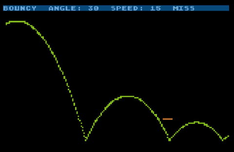

# 2019-Bouncy
Bouncing Ball game in Turbo BASIC XL for Atari 8-bit. Entry for 2019 10-line BASIC contest

My fifth 10-line BASIC contest entry for 2019 is Bouncy, a throw-the-ball-into-the-goal game loosely based on [“Cup” by Jonathan Freidin](https://www.atariarchives.org/morebasicgames/showpage.php?page=43) from the 1979 book “More BASIC Computer Games.” I have never actually played Cup, but read the sample game and code in the classic red book many times over as a kid.

The goal of Bouncy is to throw your ball into the target (not a cup, but a line in my version, so totally different.) Use the joystick to adjust the ball’s initial speed (from 10 to 50 speed-o-units) and angle (from an almost-level 10 degrees to a skyward 60 degrees.) Press the trigger to throw the ball. If it falls into the goal or bounces in, you win. (Hitting the goal from below doesn’t count.) If you miss, the goal remains unmoved: you can adjust your throw to try again.

My friend Mitch helped and helped with the hard math. (The math in this game is a lot more complected than Cup’s!) The game is just eight 120-character lines in Turbo BASIC XL on the Atari, so it goes into the PUR-120 contest category.
